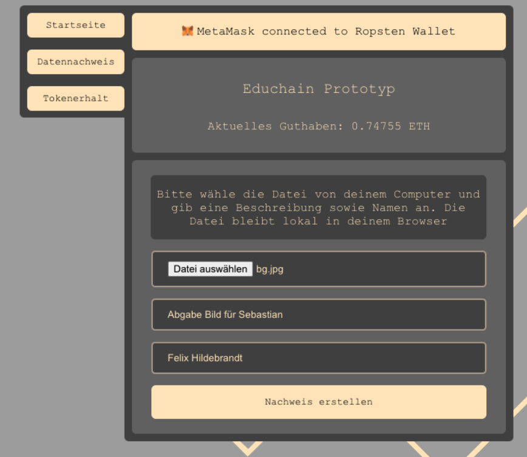
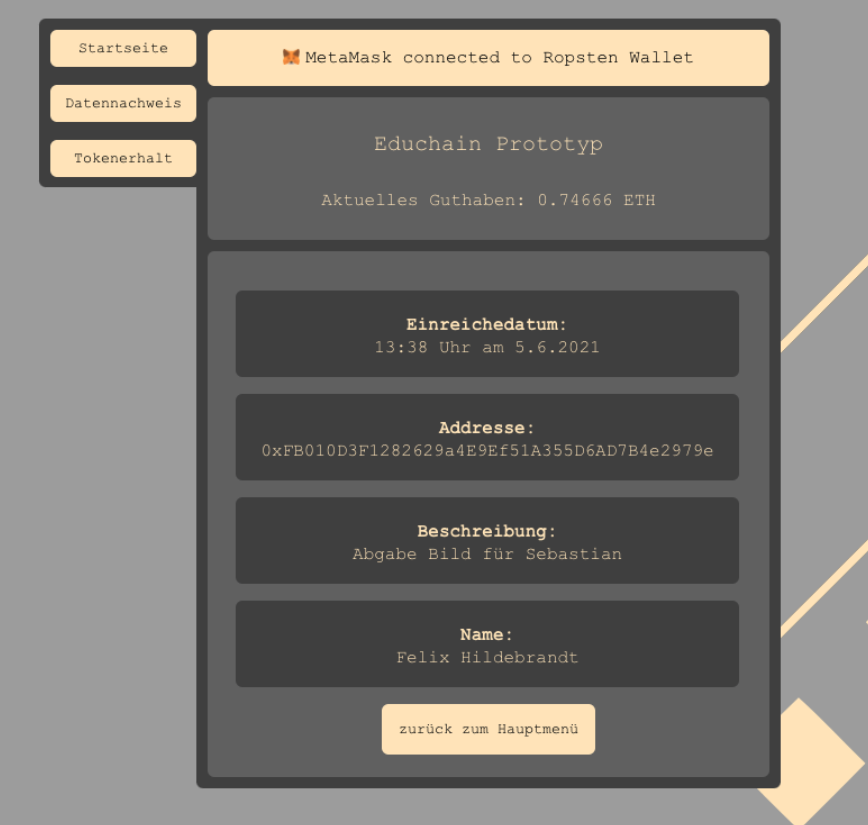
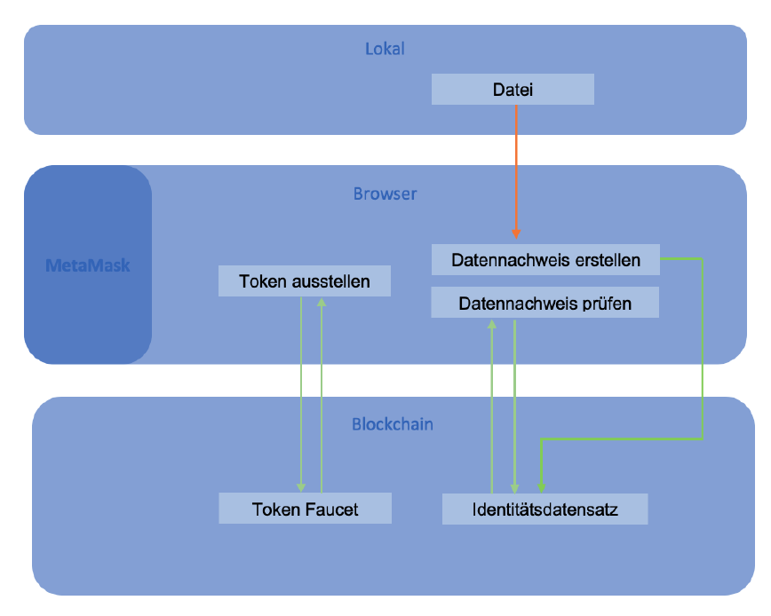
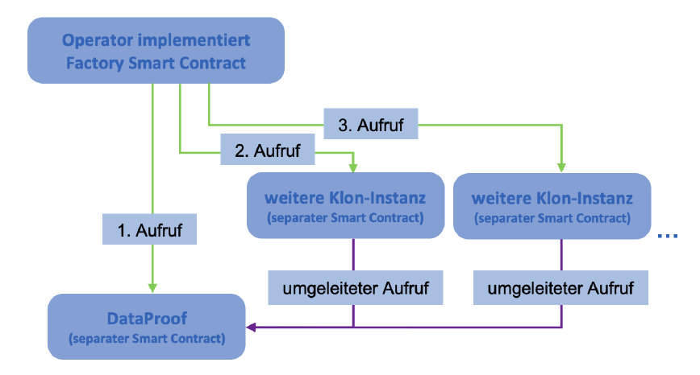

# educhain-prototype

This codebase is a prototype of the Educhain project which was developed by Felix Hildebrandt and Sebastian Wunderlich during their master studies on the University of Applied Sciences Mittweida. It aims to integrate blockchain technology at universities in order to facilitate processes.

The prototype is one utility of the Educhain concept which can be used to create file proofs for documents that need to be managed by the proffessorship and issue tokens for IRL benefits at the presentation that took place in 2021.

## Links

[Educhain Webpage](https://educhain-mw.de/)

[Live Application](https://educhain-mw.netlify.app/)

## Data Proof Showcase

## Tech Flows

## Run locally

### Init:
`cd educhain_prototype && npm i`

### Development: 
`npm start`

### Production:
`npm run build`
